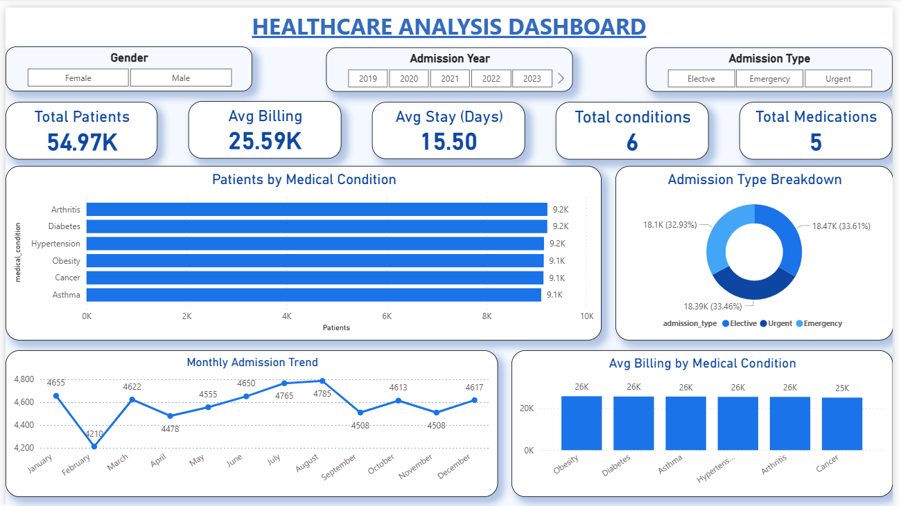
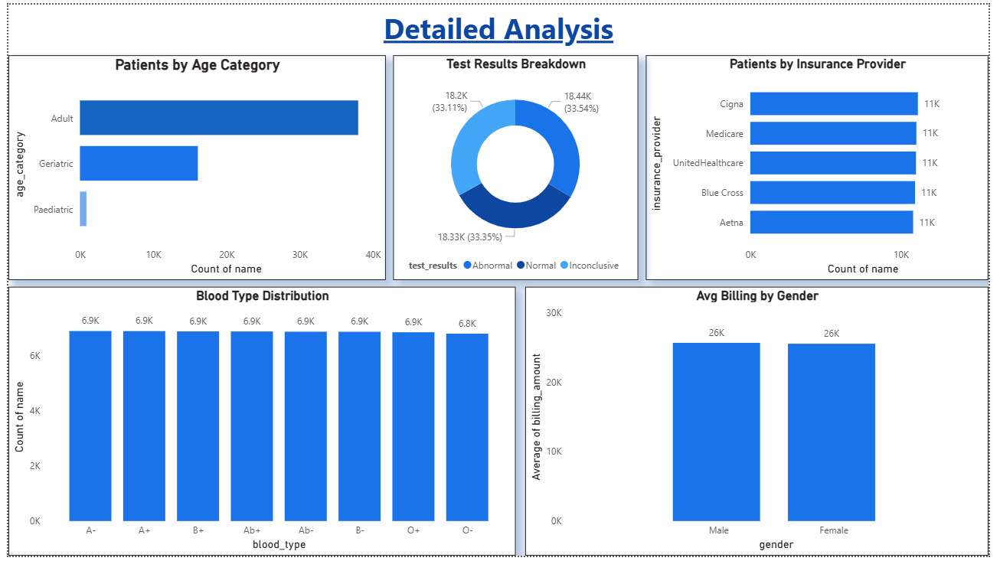

# 🏥 Healthcare Data Analysis
### End-to-End Data Analysis Project using Python | SQL | Power BI


---

## 📌 Project Overview

This is a **complete end-to-end Data Analysis project** on a Healthcare dataset containing **54,966 patient records** from 2019 to 2024. The project covers the full Data Analyst workflow — from raw data cleaning to interactive dashboard creation.

**Dataset Source:** [Kaggle — Healthcare Dataset](https://www.kaggle.com/datasets/prasad22/healthcare-dataset)

---

## 🎯 Project Objectives

- Analyze patient admission patterns, billing trends, and medical conditions
- Identify key healthcare cost drivers across age groups and conditions
- Build an interactive Power BI dashboard for business stakeholders
- Derive actionable insights and recommendations from the data

---

## 🛠️ Tools & Technologies

| Tool | Purpose |
|------|---------|
| **Python (Pandas, Matplotlib, Seaborn)** | Data Cleaning & EDA |
| **MySQL** | Data Analysis & SQL Queries |
| **Power BI** | Interactive Dashboard |
| **Jupyter Notebook** | Development Environment |

---

## 📁 Project Structure

```
healthcare-data-analysis/
│
├── 📓 HealthCare_data_cleaning.ipynb   # Data cleaning & preprocessing
├── 📓 HealthCare_EDA.ipynb             # Exploratory Data Analysis
├── 🗄️  Healthcare_sql.sql              # SQL analysis queries (12 queries)
├── 📊 Healthcare_dashboard.pbix        # Power BI dashboard (3 pages)
├── 📄 healthcare.csv                   # Cleaned dataset (54,966 rows)
├── 🖼️  Dashboard_preview_01.png        # Dashboard Page 1 screenshot
├── 🖼️  Dashboard_preview_02.png        # Dashboard Page 2 screenshot
└── 🖼️  KEY INSIGHTS & RECOMMENDATIONS.png  # Insights page screenshot
```

---

## 🔄 Project Workflow

```
Raw Data (55,500 rows)
        ↓
Step 1: Python Data Cleaning → 54,966 rows (534 duplicates removed)
        ↓
Step 2: Python EDA → 12 visualizations & insights
        ↓
Step 3: MySQL Analysis → 12 SQL queries
        ↓
Step 4: Power BI Dashboard → 3-page interactive report
```

---

## 📊 Dashboard Preview

### Page 1 — Overview Dashboard


### Page 2 — Detailed Analysis


### Page 3 — Key Insights & Recommendations


---

## 🔍 Key Insights Discovered

| # | Insight | Finding |
|---|---------|---------|
| 1 | 💰 **Obesity most expensive** | Avg billing ₹25,858 — higher than Cancer (₹25,206) |
| 2 | 🏥 **Elective costs more** | Elective (₹25,663) > Emergency (₹25,551) admissions |
| 3 | 👶 **Paediatric highest billing** | ₹26,775 avg despite only 886 patients |
| 4 | ⚠️ **High abnormal results** | 33.5% patients show Abnormal test results |
| 5 | 🫁 **Asthma longest stay** | 15.7 days avg — highest among all conditions |
| 6 | 📈 **2020 admission peak** | 11,172 patients — likely COVID-19 impact |
| 7 | 🏢 **Cigna largest provider** | Covers 11,139 patients (highest volume) |

---

## 💡 Recommendations

1. **Launch obesity prevention programs** — Highest cost condition needs early intervention
2. **Create special Paediatric insurance packages** — Highest billing despite lowest patient count
3. **Start early screening programs** — 33.5% abnormal results shows high-risk patients
4. **Dedicated Asthma outpatient programs** — Reduce avg stay from 15.7 days
5. **Strengthen Medicare partnership** — Highest avg billing provider needs negotiation
6. **Plan seasonal staffing for July-August** — Peak admission months need more resources

---

## 📈 Dataset Information

| Feature | Detail |
|---------|--------|
| Raw Records | 55,500 rows |
| Cleaned Records | 54,966 rows |
| Columns | 19 (15 original + 4 engineered) |
| Time Period | 2019 – 2024 |
| Medical Conditions | 6 (Arthritis, Diabetes, Hypertension, Obesity, Cancer, Asthma) |
| Insurance Providers | 5 (Cigna, Medicare, UnitedHealthcare, Blue Cross, Aetna) |

---

## ⚙️ Step 1 — Data Cleaning (Python)

**File:** `HealthCare_data_cleaning.ipynb`

- Removed 534 duplicate records
- Standardized column names (lowercase + underscores)
- Fixed name capitalization using `str.title()`
- Converted date columns to datetime format
- Replaced negative billing values with median
- **Engineered 4 new features:**
  - `length_of_stay` = discharge_date - date_of_admission
  - `age_category` = Paediatric / Adult / Geriatric
  - `admission_year` = extracted from date
  - `admission_month` = extracted from date

---

## 📉 Step 2 — Exploratory Data Analysis (Python)

**File:** `HealthCare_EDA.ipynb`

12 visualizations created including:
- Age distribution histogram
- Gender distribution pie chart
- Medical condition bar chart
- Billing amount distribution
- Monthly admission trend line chart
- Correlation heatmap
- And more...

---

## 🗄️ Step 3 — SQL Analysis (MySQL)

**File:** `Healthcare_sql.sql`

12 SQL queries covering:
```sql
1.  Total patient count
2.  Patients by medical condition
3.  Avg/Max/Min billing by condition
4.  Patients by admission type
5.  Gender-wise billing analysis
6.  Top 5 insurance providers
7.  Monthly admission trends
8.  Length of stay by condition
9.  Test results by condition
10. Age category analysis
11. High billing patients (subquery)
12. Blood type distribution
```

---

## 📊 Step 4 — Power BI Dashboard

**File:** `Healthcare_dashboard.pbix`

**3-Page Interactive Dashboard:**

**Page 1 — Overview**
- 5 KPI Cards (Total Patients, Avg Billing, Avg Stay, Total Conditions, Total Medications)
- Patients by Medical Condition (Bar Chart)
- Admission Type Breakdown (Donut Chart)
- Monthly Admission Trend (Line Chart)
- Avg Billing by Condition (Column Chart)
- 3 Slicers (Gender, Admission Type, Year)

**Page 2 — Detailed Analysis**
- Patients by Age Category
- Patients by Insurance Provider
- Test Results Breakdown
- Blood Type Distribution
- Avg Billing by Gender

**Page 3 — Key Insights & Recommendations**
- 7 Key Insights
- 6 Business Recommendations

---

## 🚀 How to Run This Project

### Python Notebooks:
```bash
# Install required libraries
pip install pandas matplotlib seaborn jupyter

# Open notebooks
jupyter notebook HealthCare_data_cleaning.ipynb
jupyter notebook HealthCare_EDA.ipynb
```

### SQL Queries:
```bash
# Import healthcare.csv into MySQL
# Then run Healthcare_sql.sql in MySQL Workbench
```

### Power BI Dashboard:
```bash
# Open Healthcare_dashboard.pbix in Power BI Desktop
```

---

## 👨‍💻 Author

**Sudip Kumar Jena**
- 🎓 B.Com Graduate | Aspiring Data Analyst
- 📚 Pursuing Data Science — UpGrad
- 🔗 [LinkedIn](https://linkedin.com/in/sudip-kumar-jena515)
- 🐙 [GitHub](https://github.com/sudipkumarjena)

---

## ⭐ If you found this project helpful, please give it a star!
